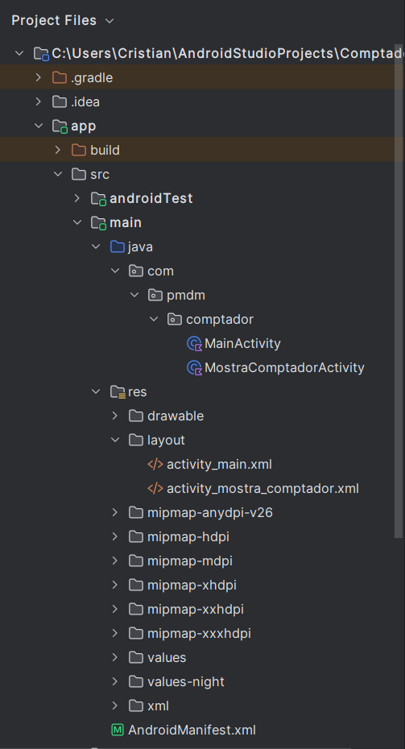
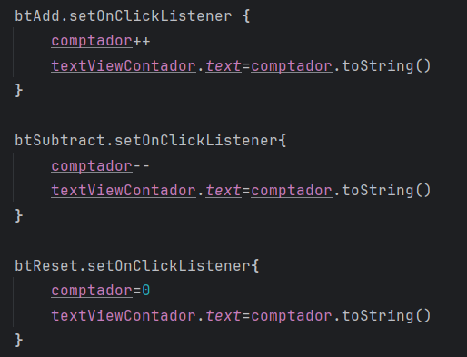
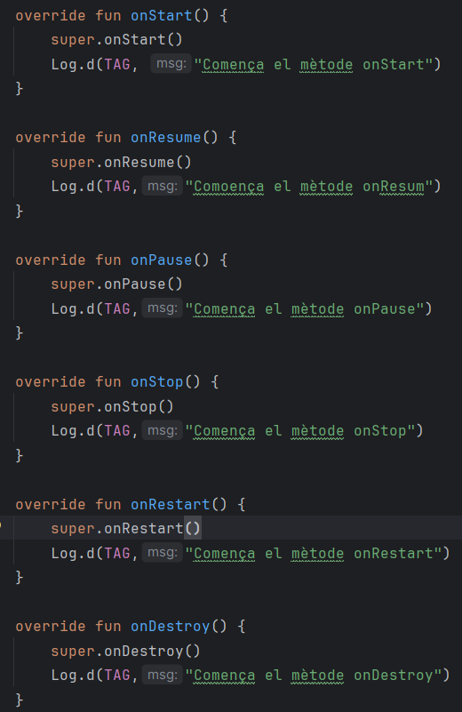
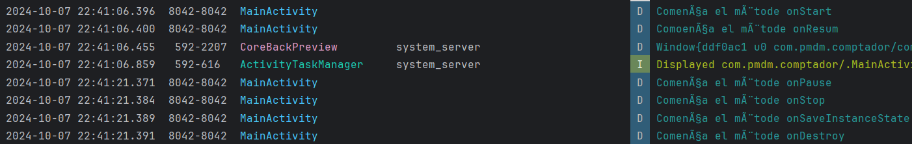
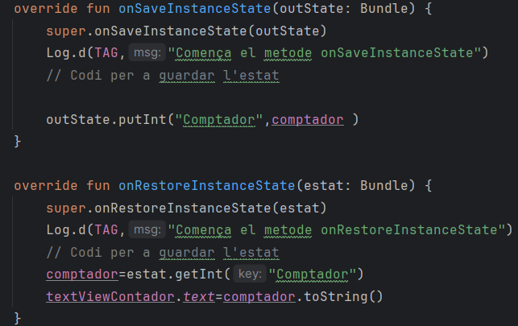
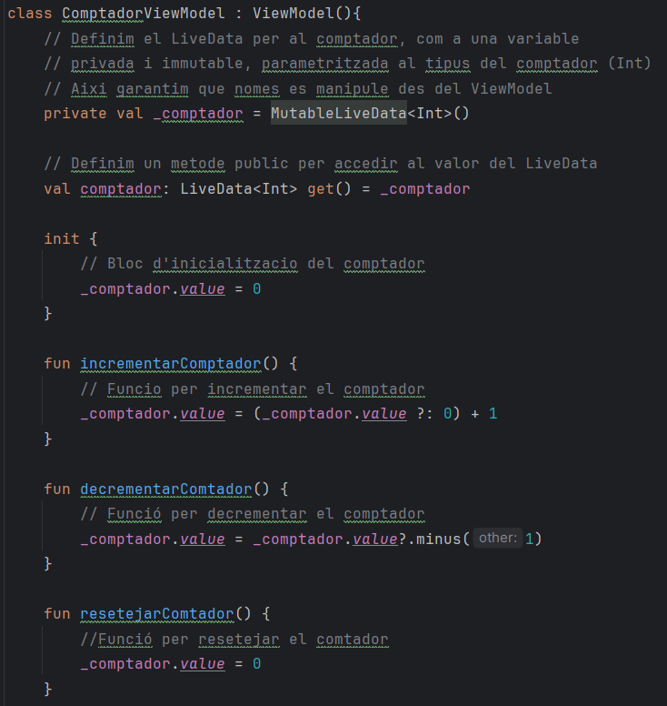
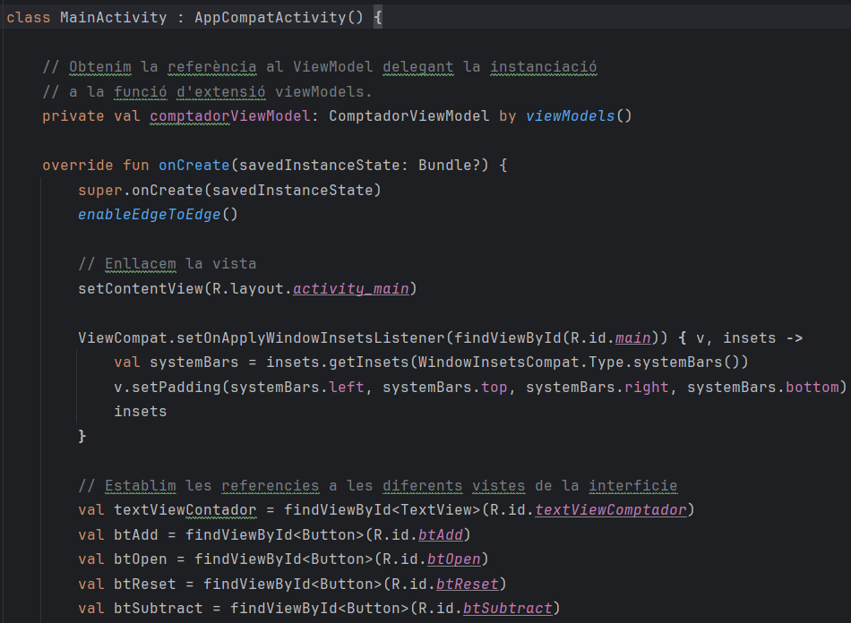
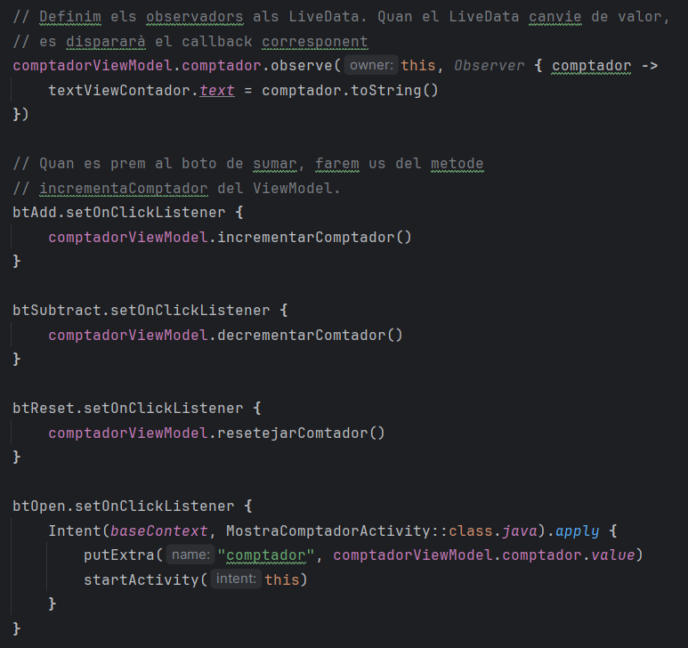

# Programació Multimedia i Dispositius Mòvils

## Avaluació de la Unitat 1

### Bloc 1. Activitats sobre el comptador

#### 1. Introducció

En aquest projecte s'ha implementat una aplicació Android que permet gestionar un comptador amb funcions per incrementar, decrementar i reinicialitzar el seu valor. També s'ha afegit la funcionalitat de transferir aquest valor a una segona activitat mitjançant Intents. 

A continuació es mostra l'estructura del projecte.

Les carpetes més importants són la de main/java on es troben les diverses activitats de l'aplicació, les quals contenen el codi font i la de main/res/layouts/ on es troben els fitxers XML que defineixen les interfícies d'usuari de les activitats. També es important el fitxer AndroidManifest.xml que declara les activitats, permisos i configuracions generals de l'aplicació.

---

#### 2. Pasos Seguits

##### 2.1. Modificació del Layout de l'Activitat Principal

El layout de l'activitat principal es va reemplaçar pel proporcionat a l'enunciat. Es va afegir un TextView per mostrar el valor del comptador, així com tres botons per a les accions de "decrementar", "reset" i "incrementar".

##### 2.2. Afegir Funcionalitat als Botons

En el codi de la classe MainActivity, es va afegir la funcionalitat necessària per als botons de incrementar, decrementar i reiniciar. Els botons actualitzen el valor del comptador i el mostren al TextView.

##### 2.3. Implementació del Cicle de Vida de l'Activitat

Es van sobreescriure els mètodes del cicle de vida (onStart(), onResume(), onPause(), etc.) per registrar les diferents fases del cicle de vida de l'activitat al log de l'aplicació.

Amb això podem accedir al logcat per seguir el cicle de vida de l'aplicació com podem veure a continuació.

##### 2.4. Gestionar la Pèrdua d'Estat

Es van implementar els mètodes onSaveInstanceState() i onRestoreInstanceState() per evitar la pèrdua d'estat en canviar l'orientació del dispositiu. Es va guardar i restaurar el valor del comptador.

##### 2.5. Creació de la Segona Activitat

Es va crear una segona activitat MostraComptadorActivity per mostrar el valor del comptador. Aquesta activitat es va obrir mitjançant un Intent des de la MainActivity.

A la nova activitat, es va capturar el valor passat mitjançant el Intent i es va mostrar al TextView.

#### 3. Resultats Obtinguts

- Els botons de incrementar, decrementar i reiniciar funcionen correctament, modificant el valor del comptador en temps real.
- El valor del comptador es manté després dels canvis d'orientació gràcies a la implementació de onSaveInstanceState() i onRestoreInstanceState().
- La segona activitat s'obri correctament amb el valor del comptador actual.

#### 4. Conclusions

- És important gestionar correctament el cicle de vida de l'aplicació per evitar la pèrdua de l'estat quan es canvia l'orientació del mòvil.
- En l'aplicació es separen les diferents responsabilitats entre diverses Activitats les quakls es comuniquen entre elles amb intents.

#### 5. Questió: Per crear una nova activitat, seria suficient amb crear el fitxer XML amb el layout i el fitxer Kotlin amb el codi per gestionar-la?

No seria suficient amb només crear el fitxer XML per al layout i el fitxer Kotlin per gestionar l'activitat. A més d'aquests dos passos, també cal afegir la nova activitat al fitxer AndroidManifest.xml perquè el sistema Android la reconega.
Si no es registra al Manifest, Android no podrà gestionar correctament la navegació a aquesta activitat.

---

### Bloc 2. Comptador amb MVVM

#### 1. Introducció

Aquest projecte consisteix en una aplicació Android que implementa el patró d'arquitectura MVVM (Model-View-ViewModel) per gestionar un comptador. L'aplicació permet sumar, restar i reiniciar el comptador, així com mostrar el seu valor en una altra activitat.

#### 2. Pasos Seguits

##### 2.1 Creació del ViewModel

- Es va crear una Classe ComptadorViewModel que hereta de ViewModel per gestionar l'estat del comptador.
- Es va utilitzar MutableLiveData per emmagatzemar el valor del comptador, permetent actualitzacions automàtiques a la interfície d'usuari.
- Es van implementar mètodes per incrementar, decrementar i reiniciar el comptador.

##### 2.2. Implementació de la Activitat Principal

- Es va crear la Classe MainActivity.
- S'han configurat diversos botons per incrementar, decrementar, reiniciar el comptador i obrir una nova activitat.
- Es va establir un observador al LiveData del ViewModel per actualitzar el TextView amb el valor del comptador.

#### 3. Resultats Obtinguts

- L'aplicació permet incrementar, decrementar i resetejar el comptador en temps real.
- Obrir una altra activitat que mostra el valor actual del comptador.

#### 4. Conclusions

La implementació del patró MVVM permet una separació clara entre la lògica i la interfície d'usuari i gestiona el manteniment de l'estat del comptador inclús quan l'activitat es destrueix i es torna a recuperar.

#### 5. Qüestió: Per tal de mostrar el valor del comptador en l'activitat MostraComptadorActivity, creem una Intent i li afegim com a paràmetre el valor del comptador del ViewModel. Amb l'arquitectura MVVM, aquest seguiria sent necessari? No podem llançar la Intent sense proporcionar cap argument? Si modifiquem la segona activitat per a que faça ús també del ViewModel, no podríem accedir directament al valor? Investiga sobre aquesta possibilitat.

- Es necessita afegir el valor del comptador a l'Intent, ja que la Classe MostraComptadorActivity no comparteix el mateix ViewModel que MainActivity. Així com està, cada activitat te el seu cicle de vida i no comparteixen l'estat.

- Si es llança un intent sense passar-li arguments, MostraComptadorActivity no tindrà accés al valor del comptador i no el mostrarà.

- Es podria accedir directament al valor del comptador si les diverses activitats comparteixen el ViewModel.

---

### Bloc 3. Comptador amb Compose

#### 1. Introducció

En aquest projecte, hem desenvolupat una aplicació Android que implementa un comptador utilitzant l'arquitectura de Jetpack Compose. La interfície d'usuari permet incrementar, decrementar i reiniciar el valor del comptador, així com obrir una segona activitat que mostra el valor actual del comptador.

#### 2. Pasos seguits

##### 2.1. Creació de la Classe Principal (MainActivity)

- Es va crear la classe MainActivity, que extén ComponentActivity.

##### 2.2. : Implementació de la Interfície d'Usuari

- Es crea la funció ComptadorApp que conté el disseny de la interfície d'usuari.
- S'utilitzen composables (column, row, etc) per organitzar els diferents botons que s'han creat per incrementar, decrementar i posar a zero el comptador.

#### 3. Resultats Obtinguts

- S'ha implementat un comptador que espot incrementar, decrementar, resetejar i mostrar en una nova activitat.
- Es manté l'estat del valor del comptador utilitzant rememberSaveable.

#### 4. Conclusions

- Amb Compose és possible crear i configurar l'interfície d'usuari.
- Mitjançant composables, es més fàcil guardar l'estat per evitar pèrdues de informació.

